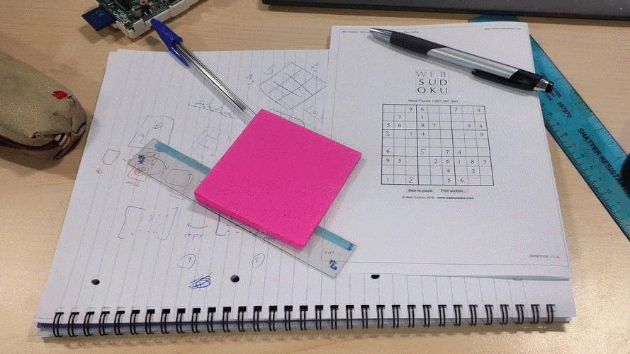
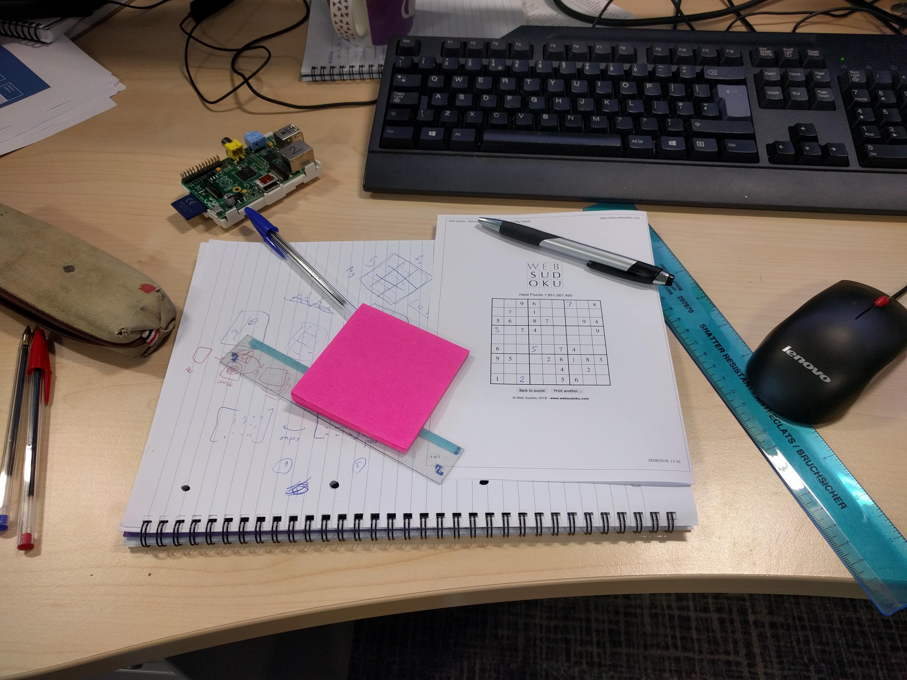
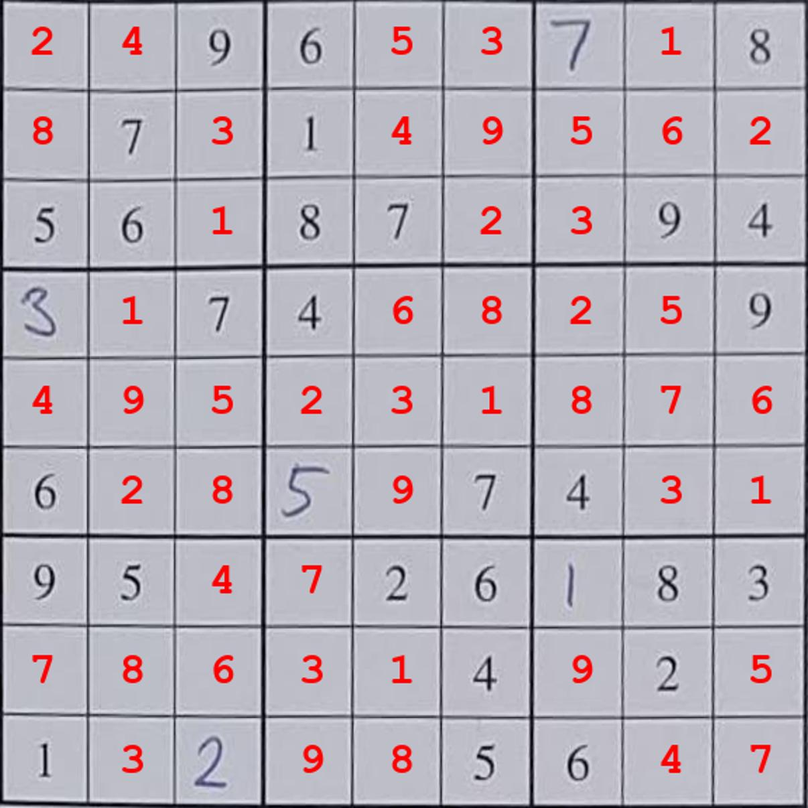
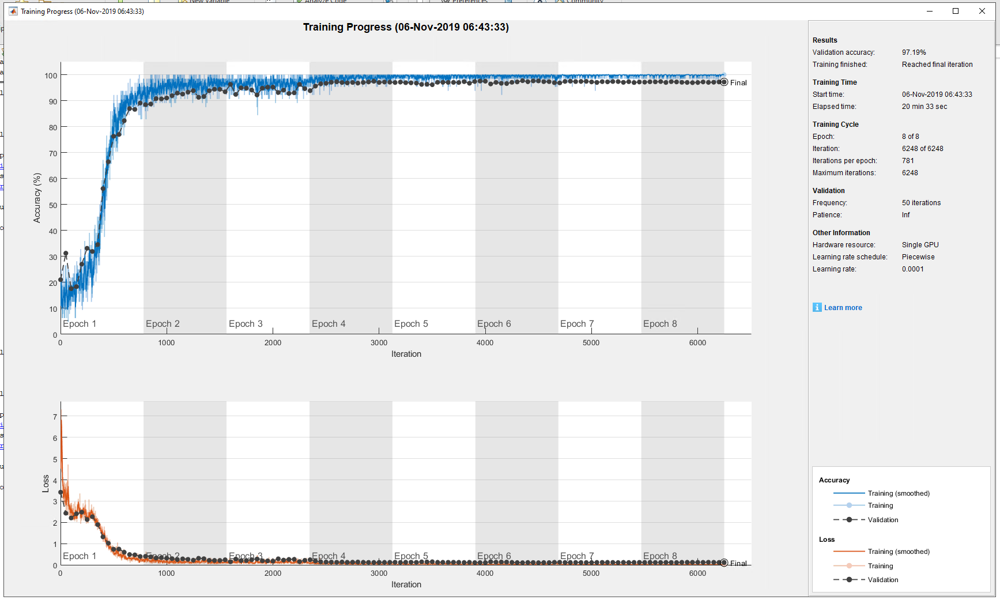
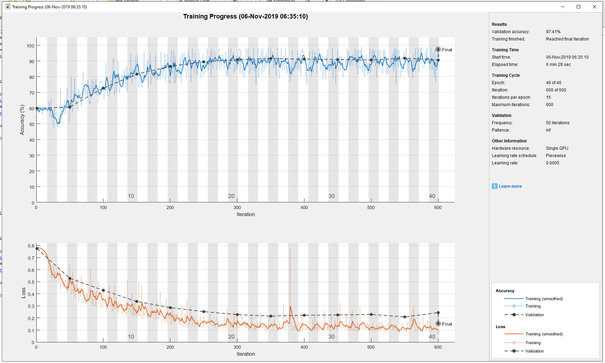

# Deep Sudoku Solver

__Takes an uncontrolled image of a sudoku puzzle, identifies the location, reads the puzzle, and solves it.__

This example was originally put together for the [UK MATLAB Expo](https://www.matlabexpo.com/uk) 2018, for a talk entitled _Computer Vision and Image processing with MATLAB ([video](https://www.mathworks.com/videos/image-processing-and-computer-vision-with-matlab-1541003708736.html), [blog post](https://blogs.mathworks.com/deep-learning/2018/11/15/sudoku-solver-image-processing-and-deep-learning/))_. It is intended to demonstrate the use of a combination of deep learning and image procesing to solve a computer vision problem.



## Getting started

- Get a copy of the code either by cloning the repository or downloading a .zip
- Run the example live script getting_started.mlx, or see the [usage](usage) section below

## Details

Broadly, the algorithm is divided into four distinct steps:

1. Find the sudoku puzzle in an image using deep learning (sematic segmentation)
2. Extracts each of the 81 number boxes in the puzzle using image processing.
3. Read the number contained in each box using deep learning.
4. Solve the puzzle using opimisation.

For more details see the original [Expo talk](https://www.mathworks.com/videos/image-processing-and-computer-vision-with-matlab-1541003708736.html).

__Input:__



__Result:__



## Usage

- In MATLAB set the top level directory as the working directory then runn `install()` to add the required folders to the MATLAB path.
- Run `setupDataGitHub()` to fetch the required training data from GitHub. The data is ~70 MB, downloading and extracting this can take a few minutes.
- Run `sudoku.trainSemanticSegmentation()`. This will train the semantic segmentation network and save the trained network in the `models/` folder.
- Run `sudoku.trainNumberNetwork()`. This will train the number classification network and save the trained network in the `models/` folder.
- Once both networks have been trained you can process an image as follows:

```matlab
im = imread("docs/example.jpg");
% reduce the size of the example image
im = imresize(im, 0.5);
solver = sudoku.PuzzleSolver();
solution = solver.process(im)
```

## Training

For reference the training curves for the two networks should look as follows:

__Classfication training__



__Segmentation training__



By the end of training, the segmentation results should look something like this:


## Contributing

Please file any bug reports or questions as [GitHub issues](https://github.com/mathworks/deep-sudoku-solver/issues).

_Copyright 2018-2019 The MathWorks, Inc._